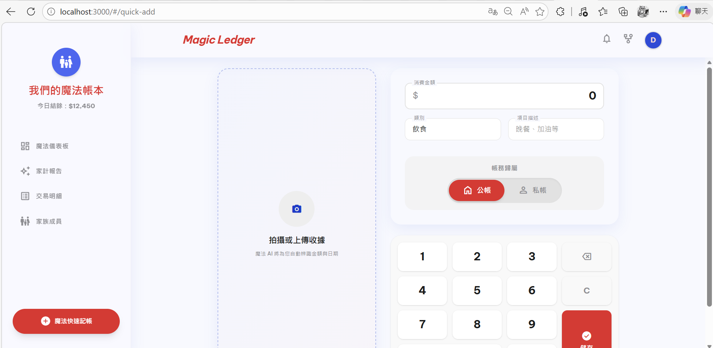
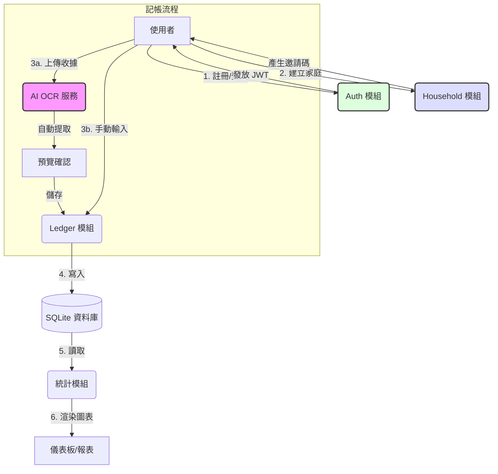

# Family Magic Ledger (家庭透明化記帳系統)

這是一個專為家庭設計的透明化記帳系統，支援 AI OCR 收據辨識、公私帳隔離以及視覺化財務報表。

## ✨ 核心特色
- **AI 魔法掃描**：拍照即辨識，自動提取收據金額與日期。
- **透明化協作**：家庭成員共享帳本，公私帳一鍵切換，平衡隱私與透明。
- **極簡輸入**：專為行動端優化的自定義虛擬鍵盤，3 秒完成記帳。
- **視覺化報表**：直觀的支出分佈與趨勢分析。

## 🛠️ 技術棧
- **Frontend**: React, Vite, Tailwind CSS, shadcn/ui
- **Backend**: FastAPI (Python), SQLAlchemy, JWT
- **Database**: SQLite
- **OCR**: Tesseract OCR

---

## 🔄 系統流程圖

---

## 🚀 快速啟動

### 後端 (Backend)
1. 進入 `backend` 目錄
2. 建立虛擬環境：`python -m venv venv`
3. 啟動環境：`venv\Scripts\activate`
4. 安裝套件：`pip install -r requirements.txt`
5. 啟動伺服器：`uvicorn main:app --reload`

### 前端 (Frontend)
1. 進入 `magic-ledger-app` 目錄
2. 安裝依賴：`npm install`
3. 啟動開發環境：`npm run dev`

---

## 📄 專案文件
- [PRD V1 (產品需求文件)](PRD_V1.md)
- [SDD V1 (軟體設計文件)](SDD_V1.md)
- [測試指南](backend/test_api.py)

---
Developed with ✨ by Gemini CLI
