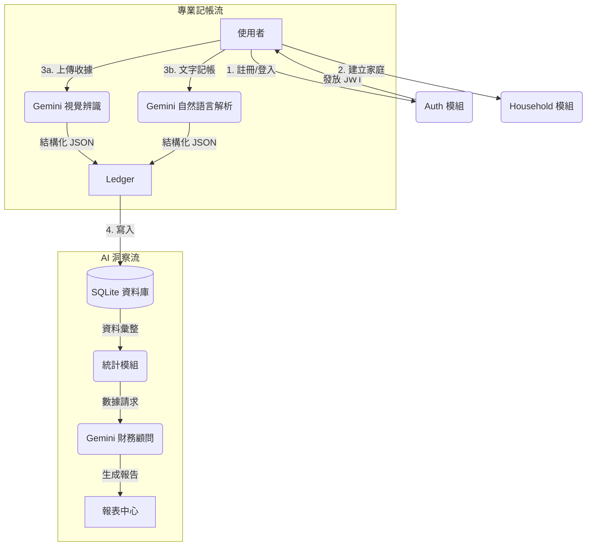

# Family Magic Ledger (家庭透明化記帳系統) V2.0

這是一個專為家庭設計的專業級透明化 AI 記帳系統，採用 FastAPI + React 現代分層架構，整合 Google Gemini 頂尖人工智慧，平衡隱私與協作。

## ✨ V2.0 核心特色
- **AI 魔法理財顧問**：動態分析全家支出，提供深度財務洞察與省錢建議。
- **專業分層架構**：嚴謹的 API、Service、Data、Schema 分層設計，具備商業級擴展性。
- **極速 AI 掃描**：整合 Gemini 2.0/2.5 Flash，秒級辨識收據並自動分類。
- **安全性強化**：環境變數強型別驗證，API Key 後端代理隔離，確保金鑰零外洩。

### 🪄 AI 財務分析展示

---

## 🛠️ 專業技術棧
- **Frontend**: React, Vite, Tailwind CSS, shadcn/ui
- **Backend**: FastAPI (Python), SQLAlchemy, Pydantic Settings
- **Security**: JWT (Jose), Bcrypt (Passlib)
- **AI Engine**: Google Gen AI SDK (Gemini 2.0/2.5 Flash)
- **Database**: SQLite

---

## 🔄 系統流程圖

---

## 🚀 快速啟動

### 後端 (Backend)
1. 進入 `backend` 目錄
2. 啟動環境：`venv\Scripts\activate`
3. 安裝專業版套件：`pip install -r requirements.txt`
4. 啟動伺服器：`uvicorn main:app --reload`

### 前端 (Frontend)
1. 進入 `magic-ledger-app` 目錄
2. 啟動開發環境：`npm run dev`

---

## 📄 技術架構文檔
- [ARCHITECTURE.md (專業架構說明)](ARCHITECTURE.md)
- [PRD V1 (產品需求)](PRD_V1.md)
- [SDD V1 (詳細設計)](SDD_V1.md)

---
Developed with 💎 & ✨ by Gemini CLI
